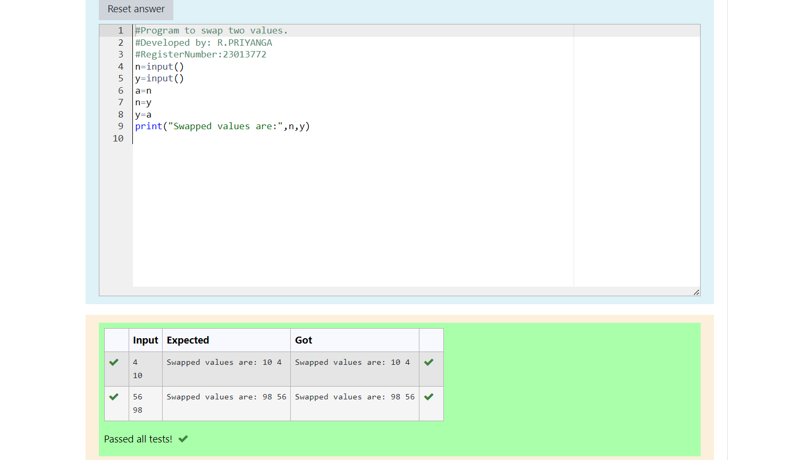

# Swapping-two-values
## AIM:
To write a python program for swapping of two values
## EQUIPEMENT'S REQUIRED: 
PC
Anaconda - Python 3.7
## ALGORITHM: 
### Step 1:
Get the two values from the user
### Step 2: 
Assign the value of second variable to a temporary variable 
### Step 3: 
Assign the value of the first variable to the second variable.
### Step 4:  
Assign the value in temporary variable to the first variable
### Step 5: 
Print both the values it would be interchanged
### Step 6: 
End the program
## PROGRAM:
# Program to find the distance between two points.
# Developed by: R.PRIYANGA
# RegisterNumber:23013772
~~~
import math
def distance(x1,y1,x2,y2):
    dx=x2-x1
    dy=y2-y1
    d=math.sqrt(dx*2+dy*2)
    return d
x1=4
y1=2
x2=10
y2=6
d=distance(x1,y1,x2,y2)
print(round(d,2))
~~~
## output:

## RESULT:
Thus the swapping of two values are successfully executed.

